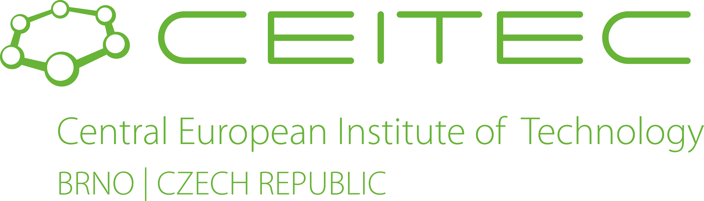
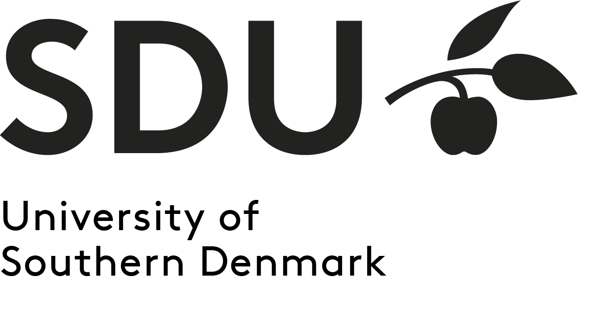
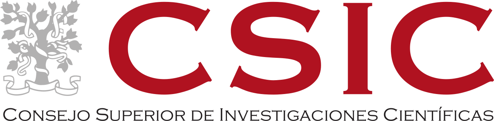

Since February 2026, I have been working at [ImageTwin AI GmbH](https://imagetwin.ai/), where I focus on detecting integrity issues in figures published in scientific articles.
<table style="border: none;">
<tr style="border: none;"> 
<td style="border: none;"></td>
</tr>
</table>
Previously, I worked on establishing experimental model systems for visual proteomics at [Max Planck Institute of Biophysics](https://en.wikipedia.org/wiki/Max_Planck_Institute_of_Biophysics). I was also affiliated with [Central European Institute of Technology](https://en.wikipedia.org/wiki/Central_European_Institute_of_Technology), where we used machine learning tools to analyze genomic data; with [University of Southern Denmark](https://en.wikipedia.org/wiki/University_of_Southern_Denmark), where we worked on multiple medical image analysis projects; with [Spanish National Research Council](https://en.wikipedia.org/wiki/Spanish_National_Research_Council), where we contributed to the development of the cryo-EM image processing framework called [Scipion](http://scipion.i2pc.es/); and with [Norwegian University of Science and Technology](https://en.wikipedia.org/wiki/Norwegian_University_of_Science_and_Technology), where we conducted research on automated melanoma recognition techniques.
<table style="border: none;">
<tr style="border: none;"> 
<td style="border: none;"></td>
<td style="border: none;"></td>
<td style="border: none;"></td>
<td style="border: none;"></td>
<td style="border: none;"></td>
</tr>
</table>
I received my Ph.D. degree in image processing from [Masaryk University](https://en.wikipedia.org/wiki/Masaryk_University) in 2015. I have online research profiles at [Google Scholar](https://scholar.google.com/citations?user=KcUL5tsAAAAJ), [ResearchGate](https://www.researchgate.net/profile/Tomas-Majtner), [Scopus](https://www.scopus.com/authid/detail.uri?authorId=55547213000), [Web of Science/Publons](https://publons.com/researcher/1945502/tomas-majtner/), and [ORCID](https://orcid.org/0000-0002-5279-8806).
<table style="border: none;">
<tr style="border: none;"> 
<td style="border: none;"></td>
</tr>
</table>
My [ha-index](https://www.irif.fr/~haberm//haindex.html) is 93 and my Erdős number is 4 (based on [CSAuthors](https://www.csauthors.net/distance/tomas-majtner/paul-erdos)).
