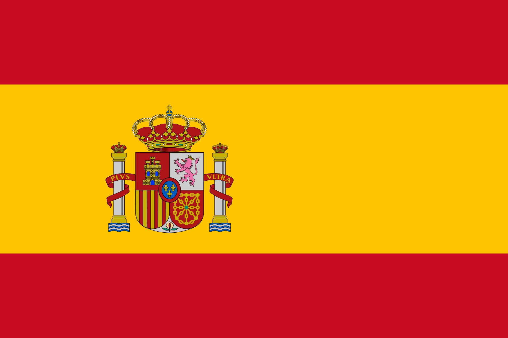
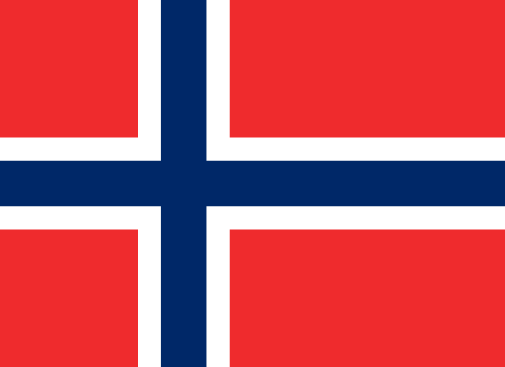
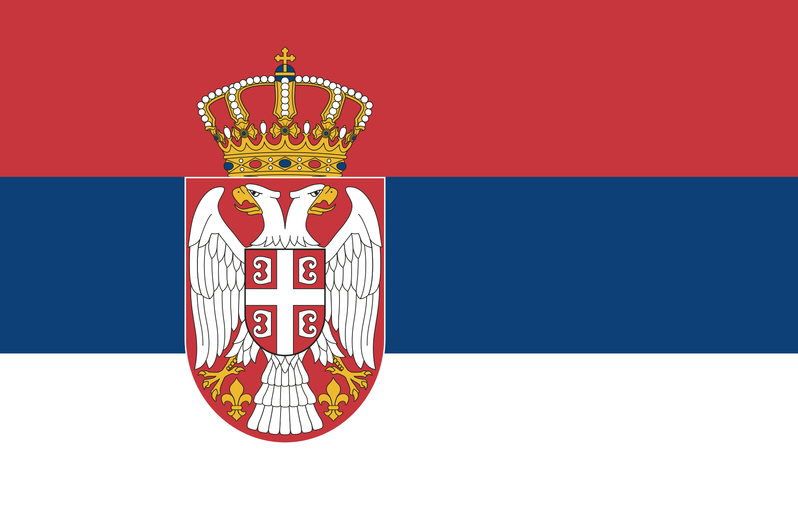



Education
=
* <b>Ph.D. in Image Processing</b> (2010 - 2015)   
  [Masaryk University](https://www.muni.cz/en), Brno, Czech Republic   
  Doctoral thesis: <i>[Texture-Based Image Description in Fluorescence Microscopy](https://is.muni.cz/th/dcxrf/thesis.pdf)</i>
  
* <b>Master in Finance</b> (2010 - 2012)   
  [Masaryk University](https://www.muni.cz/en), Brno, Czech Republic   
  Master thesis: <i>[The Use of Electronic Signature in Banking](https://is.muni.cz/th/t7oiw/DP.pdf)</i> (in Slovak)
  
* <b>Master in Applied Informatics</b> (2008 - 2010)   
  [Masaryk University](https://www.muni.cz/en), Brno, Czech Republic   
  Master thesis: <i>[Image Data Compression](https://is.muni.cz/th/ohoal/dp.pdf)</i> (in Slovak)
  
* <b>Bachelor in Study of Religions</b> (2014 - 2017)  
  [Masaryk University](https://www.muni.cz/en), Brno, Czech Republic   
  Bachelor thesis: <i>[The Concept of Buddhist Economics from the Study of Religions View](https://is.muni.cz/th/ojtm5/Bc.pdf)</i> (in Slovak)
  
* <b>Bachelor in Applied Informatics</b> (2005 - 2008)   
  [Masaryk University](https://www.muni.cz/en), Brno, Czech Republic   
  Bachelor thesis: <i>[Algorithms for Similarity Query Evaluation](https://is.muni.cz/th/iln9y/Bc.pdf)</i> (in Slovak)

Research Positions
======
* <b>PostDoc @ Max Planck Institute of Biophysics ([MPI](https://www.biophys.mpg.de/en))</b> (since 2022)  
  [Max Planck Society](https://www.mpg.de/de), Frankfurt am Main, Germany   
  
* <b>PostDoc @ Central European Institute of Technology ([CEITEC](https://www.ceitec.eu))</b> (2020 - 2022)  
  [Masaryk University](https://www.muni.cz/en), Brno, Czech Republic   
  Project: <i>Postdoc2@MUNI (No. CZ.02.2.69/0.0/0.0/18_053/0016952)</i>

* <b>PostDoc @ The Mærsk Mc-Kinney Møller Institute ([MMMI](https://www.sdu.dk/en/mmmi))</b> (2018 - 2020)  
  [University of Southern Denmark](https://www.sdu.dk/en), Odense, Denmark   
  Project: <i>EFFICACY – An effective colorectal cancer-screening program based on novel dual-mode wireless endoscopic capsules</i>

* <b>PostDoc @ [Biocomputing Unit](http://biocomputingunit.es) of Spanish National Centre for Biotechnology ([CNB](http://www.cnb.csic.es/index.php/en/))</b> (2017 - 2018)  
  [Spanish National Research Council](https://www.csic.es/en), Madrid, Spain   
  Project: <i>H2020-WEST-LIFE-675858 – West life: World-wide E-infrastructure for structural biology</i>
  
* <b>PostDoc @ Norwegian Colour and Visual Computing Laboratory ([Colourlab](http://colorlab.no))</b> (2016 - 2017)  
  [Norwegian University of Science and Technology](https://www.ntnu.edu/), Gjøvik, Norway   
  Project: <i>IQ-MED: Image Quality enhancement in MEDical diagnosis, monitoring and treatment</i>

* <b>Doctoral @ Centre for Biomedical Image Analysis ([CBIA](https://cbia.fi.muni.cz/))</b> (2010 - 2015)  
  [Masaryk University](https://www.muni.cz/en), Brno, Czech Republic   
  Projects: <i>GBP302/12/G157 – Dynamics and Organization of Chromosomes in the Cell Cycle and during Differentiation under Normal and Pathological Conditions  GA14-22461S – Development and Study of Methods for Live Cell Quantification</i>

Short Term Research Stays
======
* <b>([STSM grant](http://eubias.org/NEUBIAS/mobility-grants/)) @ Faculty of Technical Sciences ([FTN](http://www.ftn.uns.ac.rs/n1386094394/faculty-of-technical-sciences)) </b> (2 weeks in 2019)  
  [University of Novi Sad](https://www.uns.ac.rs/index.php/en/), Novi Sad, Serbia   
  Project: <i>Development and evaluation of 𝛼𝐿𝐵𝑃 − 𝑚𝑎𝑝𝑠 for improved classification in biomedical domain</i>
  
* <b>([Erasmus Research Internship](https://is.muni.cz/www/172786/certificates/2013_Birmingham.pdf)) @ Digital Media Technology ([DMT](http://www.bcu.ac.uk/computing-engineering-and-the-built-environment/research/digital-technology/)) Lab </b> (5 months in 2013)  
  [Birmingham City University](https://www.bcu.ac.uk/), Birmingham, United Kingdom   
  Project: <i>The Analysis of CT Scans Through Hough Transform</i>
  
  
Other Work Activities
======
* <b>Teaching</b> (2011 - 2012)  
  [Faculty of Informatics](https://www.fi.muni.cz/index.html.en), [Masaryk University](https://www.muni.cz/en), Brno, Czech Republic   
  Subject: <i>Introduction to Programming using C</i> (two semesters supervision of two seminar groups)
  
* <b>Programming</b> (2008 - 2016)  
  [Institute of Computer Science](https://www.ics.muni.cz/en), [Masaryk University](https://www.muni.cz/en), Brno, Czech Republic   
  Project: <i>Development of Masaryk University web presentation</i> (part time)
  
  
Participations
======
* <b>The 3rd [NEUBIAS](http://eubias.org/NEUBIAS/neubias2020-conference/luxembourg-2019/) Conference</b>, Luxembourg city, Luxembourg    
  <i>Poster presentation</i>
  
* <b>International Computer Vision Summer School</b> ([ICVSS 2016](http://iplab.dmi.unict.it/icvss2016/)), Sicily, Italy   
  <i>Passed final examination</i> ([Certificate](https://is.muni.cz/www/172786/certificates/2016_ICVSS_exam.pdf))
  
* <b>Summer School on Image Processing</b> ([SSIP 2015](https://www.inf.u-szeged.hu/ssip/2015/)), Szeged, Hungary   
  Project: <i>Microglia cells segmentation</i> ([Certificate](https://is.muni.cz/www/172786/certificates/2015_SSIP.pdf))
  
* <b>Medical Imaging Summer School</b> ([MISS 2014](http://iplab.dmi.unict.it/miss14/)), Favignana, Sicily, Italy   
  <i>Poster presentation</i> ([Certificate](https://is.muni.cz/www/172786/certificates/2014_MISS.pdf))
  
* <b>Computer Vision Winter Workshop</b> ([CVWW 2014](http://cmp.felk.cvut.cz/cvww2014/)), Křtiny, Czech Republic   
  <i>Poster presentation</i> ([Certificate](https://is.muni.cz/www/172786/certificates/2014_CVWW.pdf))
  
* <b>Image Acquisition and Processing in Biomedical Microscopy</b> (2011)  
  Czech Academy of Sciences, Prague, Czech Republic 

* <b>Advanced Methods on Biomedical Image Analysis</b> ([AMBIA 2011](https://ambia.fi.muni.cz/2011/)), Brno, Czech Republic   
  <i>Poster presentation</i> ([Certificate](https://is.muni.cz/www/172786/certificates/2011_AMBIA.pdf))

Technical Skills
======
* <b>Active knowledge</b>: MATLAB, LaTeX, C/C++  
* <b>Basic knowledge</b>: C#, XML, SQL, Javascript, Python

Language Skills
======
* <b>Slovak</b>: mother tongue  
* <b>Czech</b>: fluent, active - C2 ([CEFR rank](https://en.wikipedia.org/wiki/Common_European_Framework_of_Reference_for_Languages))  
* <b>English</b>: fluent, active - C1 ([CEFR rank](https://en.wikipedia.org/wiki/Common_European_Framework_of_Reference_for_Languages))  
* <b>German</b>: intermediate, passive - A2-B1 ([CEFR rank](https://en.wikipedia.org/wiki/Common_European_Framework_of_Reference_for_Languages))  
* <b>Danish</b>: intermediate, passive - A2-B1 ([CEFR rank](https://en.wikipedia.org/wiki/Common_European_Framework_of_Reference_for_Languages))
