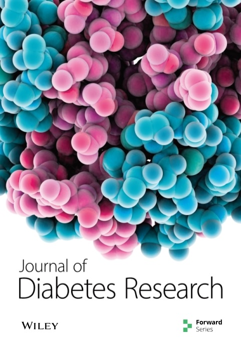
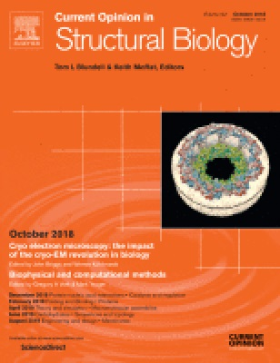

(⋆ denotes equal contribution)

<h2>Journal Articles</h2>

<table>
<tr> 
<td></td>  
<td>(J15) E. Chalupová, O. Vaculík, J. Poláček, F. Jozefov, <b>T. Majtner</b>, P. Alexiou. <a href="https://bmcgenomics.biomedcentral.com/articles/10.1186/s12864-022-08414-x">ENNGene: an Easy Neural Network model building tool for Genomics</a>. <i>BMC Genomics</i>, Vol. 23, March 2022, Article 248, BioMed Central.</td>
</tr>
<tr> 
<td></td>  
<td>(J14) <b>T. Majtner</b>, J. B. Brodersen, J. Herp, J. Kjeldsen, M. L. Halling, M. D. Jensen. <a href="https://www.thieme-connect.com/products/ejournals/abstract/10.1055/a-1507-4980">A Deep Learning Framework for Autonomous Detection and Classification of Crohn’s Disease Lesions in the Small Bowel and Colon with Capsule Endoscopy</a>. <i>Endoscopy International Open</i>, Vol. 9, September 2021, E1361–E1370, Thieme.</td>
</tr>
<tr>
<td></td> 
<td>(J13) <b>T. Majtner</b>, E. S. Nadimi, K. B. Yderstræde, V. Blanes-Vidal. <a href="https://www.sciencedirect.com/science/article/pii/S0169260720314528">Non-Invasive Detection of Diabetic Complications via Pattern Analysis of Temporal Facial Colour Variations</a>. <i>Computer Methods and Programs in Biomedicine</i>, Vol. 196, November 2020, Article 105619, Elsevier.</td>
</tr>
<tr>
<td></td> 
<td>(J12) E. S. Nadimi, <b>T. Majtner</b>, K. B. Yderstræde, V. Blanes-Vidal. <a href="https://www.nature.com/articles/s41598-020-73744-3">Facial Erythema Detects Diabetic Neuropathy Using the Fusion of Machine Learning, Random Matrix Theory and Self Organized Criticality</a>. <i>Scientific Reports</i>, Vol. 10, October 2020, Article 16785, Nature Publishing Group.</td>
</tr>
<tr>
<td></td> 
<td>(J11) B. Bajić⋆, <b>T. Majtner⋆</b>, J. Lindblad, N. Sladoje. <a href="https://digital-library.theiet.org/content/journals/10.1049/iet-ipr.2019.0705">Generalized Deep Learning Framework for HEp-2 Image Cell Recognition</a>. <i>IET Image Proccesing</i>, Vol. 14, No. 6, May 2020, pp. 1201–1208, IET.</td>
</tr> 
<tr>
<td></td> 
<td>(J10) D. Maluenda, <b>T. Majtner</b>, P. Horvath, J. L. Vilas, A. Jiménez-Moreno, J. Mota, E. Ramírez-Aportela, R. Sánchez-García, P. Conesa, L. del Caño, Y. Rancel, Y. Fonseca, M. Martínez, G. Sharov, C. A. García, D. Střelák, R. Melero, R. Marabini, J. M. Carazo, C. O. S. Sorzano. <a href="https://journals.iucr.org/d/issues/2019/10/00/ic5108/index.html">Flexible workflows for on-the-fly electron microscopy single-particle image processing using Scipion</a>. <i>Acta Crystallographica Section D</i>, Vol. 75, No. 10, October 2019, pp. 882–894, IUCr.</td>
</tr> 
<tr>
<td></td> 
<td>(J9) V. Blanes-Vidal, <b>T. Majtner</b>, L. D. Avendaño-Valencia, K. B. Yderstræde, E. S. Nadimi. <a href="https://www.hindawi.com/journals/jdr/2019/4583895/">Invisible Color Variations of Facial Erythema: A Novel Early Marker for Diabetic Complications?</a>. <i>Journal of Diabetes Research</i>, Vol. 2019, September 2019, Article 4583895, Hindawi.</td>
</tr> 
<tr>
<td></td> 
<td>(J8) A. Jiménez, S. Jonić, <b>T. Majtner</b>, J. Otón, J. L. Vilas, D. Maluenda, J. Mota, E. Ramírez-Aportela, M. Martínez, Y. Rancel, J. Segura, R. Sánchez-García, R. Melero, L. del Caño, P. Conesa, L. Skjærven, R. Marabini, J. M. Carazo, C. O. S. Sorzano. <a href="https://academic.oup.com/bioinformatics/article/35/14/2427/5221010/">Validation of electron microscopy initial models via small angle X-ray scattering curves</a>. <i>Bioinformatics</i>, Vol. 35, No. 14, July 2019, pp. 2427–2433, Oxford University Press.</td>
</tr> 
<tr>
<td></td> 
<td>(J7) <b>T. Majtner</b>, S. Yildirim-Yayilgan, J. Y. Hardeberg. <a href="https://link.springer.com/article/10.1007/s11042-018-6734-6/">Optimised deep learning features for improved melanoma detection</a>. <i>Multimedia Tools and Applications</i>, Vol. 78, No. 9, May 2019, pp. 11883–11903, Springer.</td>
</tr>  
<tr>
<td></td> 
<td>(J6) C. O. S. Sorzano, A. Jiménez, J. Mota, J. L. Vilas, D. Maluenda, M. Martínez, E. Ramírez-Aportela, <b>T. Majtner</b>, J. Segura, R. Sánchez-García, Y. Rancel, L. del Caño, P. Conesa, R. Melero, S. Jonić, J. Vargas, F. Cazals, Z. Freuberg, J. Krieger, I. Bahar, R. Marabini, J. M. Carazo. <a href="https://journals.iucr.org/f/issues/2019/01/00/aq5003/index.html">Survey of the analysis of continuous conformational variability of biological macromolecules by electron microscopy</a>. <i>Acta Crystallographica Section F</i>, Vol. 75, No. 1, January 2019, pp. 19–32, IUCr.</td>
</tr>  
<tr>
<td></td> 
<td>(J5) J. Gómez-Blanco⋆, J. M. de la Rosa-Trevín⋆, R. Marabini⋆, L. del Caño, A. Jiménez, M. Martínez, R. Melero, <b>T. Majtner</b>, D. Maluenda, J. Mota, Y. Rancel, E. Ramírez, J. L. Vilas, M. Carroni, S. Fleischmann, E. Lindahl, A. W. Ashton, M. Basham, D. K. Clare, K. Savage, C. A. Siebert, G. Sharov, C. O. S. Sorzano, P. Conesa, J. M. Carazo. <a href="https://www.sciencedirect.com/science/article/pii/S1047847718302740">Using Scipion for stream image processing at Cryo-EM facilities</a>. <i>Journal of Structural Biology</i>, Vol. 204, No. 3, December 2018, pp. 457–463, Elsevier.</td>
</tr>  
<tr>
<td></td> 
<td>(J4) J. L. Vilas, N. Tabassum, J. Mota, D. Maluenda, A. Jiménez-Moreno, <b>T. Majtner</b>., J. M. Carazo, S. T. Acton, C. O. S. Sorzano. <a href="https://www.sciencedirect.com/science/article/pii/S0959440X18300551/">Advances in image processing for single-particle analysis by electron cryomicroscopy and challenges ahead</a>. <i>Current Opinion in Structural Biology</i>, Vol. 52, October 2018, pp. 127–145, Elsevier.</td>
</tr> 
<tr>
<td></td> 
<td>(J3) C. O. S. Sorzano, J. Vargas, J. L. Vilas, A. Jiménez-Moreno, J. Mota, <b>T. Majtner</b>, D. Maluenda, M. Martínez, R. Sánchez-García, J. Segura, J. Otón, R. Melero, L. del Caño, P. Conesa, J. Gómez-Blanco, Y. Rancel, R. Marabini, J. M. Carazo. <a href="http://yokohamapublishers.jp/online2/opaao/vol2/p299.html">Swarm optimization as a consensus technique for Electron Microscopy Initial Volume</a>. <i>Applied Analysis and Optimization</i>, Vol. 2, No. 2, August 2018, pp. 299–313, Yokohama Publishers.</td>
</tr> 
<tr>
<td></td> 
<td>(J2) C. O. S. Sorzano, E. Fernández-Giménez, V. Peredo-Robinson, J. Vargas, <b>T. Majtner</b>, G. Caffarena, J. Otón, J. L. Vilas, J. M. de la Rosa-Trevín, R. Melero, J. Gómez-Blanco, J. Cuenca, L. del Caño, P. Conesa, R. Marabini, J. M. Carazo. <a href="https://www.sciencedirect.com/science/article/pii/S1047847718300844/">Blind estimation of DED camera gain in Electron Microscopy</a>. <i>Journal of Structural Biology</i>, Vol. 203, No. 2, August 2018, pp. 90–93, Elsevier.</td>
</tr> 
<tr>
<td></td> 
<td>(J1) R. Stoklasa, <b>T. Majtner</b>, D. Svoboda. <a href="https://www.sciencedirect.com/science/article/pii/S0031320313003932/">Efficient k-NN based HEp-2 cells classifier</a>. <i>Pattern Recognition</i>, Vol. 47, No. 7, July 2014, pp. 2409–2418, Elsevier.</td>
</tr> 
</table>

<h2>Conference Papers</h2>

<table>
<tr> 
<td></td>  
<td>(C12) <b>T. Majtner</b>. <a href="https://link.springer.com/chapter/10.1007/978-3-030-89128-2_21">HEp-2 Cell Image Recognition with Transferable Cross-Dataset Synthetic Samples</a>. <i>19th International Conference on Computer Analysis of Images and Patterns (CAIP 2021)</i>, LNCS 13052, pp. 215–225, Springer.</td>
</tr>
<tr> 
<td></td>  
<td>(C11) <b>T. Majtner</b>, B. Bajić, J. Herp. <a href="https://link.springer.com/chapter/10.1007/978-3-030-93420-0_20">Texture-Based Image Transformations for Improved Deep Learning Classification</a>. <i>25th Iberoamerican Congress on Pattern Recognition (CIARP 2021)</i>, LNCS 12702, pp. 207–216, Springer.</td>
</tr>
<tr> 
<td></td>  
<td>(C10) <b>T. Majtner</b>, E. S. Nadimi. <a href="https://link.springer.com/chapter/10.1007/978-3-030-29888-3_40">Comparison of Deep Learning-Based Recognition Techniques for Medical and Biomedical Images</a>. <i>18th International Conference on Computer Analysis of Images and Patterns (CAIP 2019)</i>, LNCS 11678, pp. 492–504, Springer.</td>
</tr>
<tr> 
<td></td>  
<td>(C9) <b>T. Majtner</b>, B. Bajić, J. Lindblad, N. Sladoje, V. Blanes-Vidal, E. S. Nadimi. <a href="https://link.springer.com/chapter/10.1007/978-3-030-20205-7_36">On the Effectiveness of Generative Adversarial Networks as HEp-2 Image Augmentation Tool</a>. <i>21st Scandinavian Conference on Image Analysis (SCIA 2019)</i>, LNCS 11482, pp. 439–451, Springer.</td>
</tr>
<tr> 
<td></td>  
<td>(C8) <b>T. Majtner</b>, S. Yildirim-Yayilgan, J. Y. Hardeberg. <a href="http://ieeexplore.ieee.org/document/7821017/">Combining Deep Learning and Hand-Crafted Features for Skin Lesion Classification</a>. <i>6th International Conference on Image Processing Theory, Tools and Applications (IPTA 2016)</i>, pp. 1–6, IEEE.
</td>
</tr>  
<tr> 
<td></td>  
<td>(C7) <b>T. Majtner</b>, K. Lidayová, S. Yildirim-Yayilgan, J. Y. Hardeberg. <a href="http://ieeexplore.ieee.org/document/7764580/">Improving Skin Lesion Segmentation in Dermoscopic Images by Thin Artefacts Removal Methods</a>. <i>6th European Workshop on Visual Information Processing (EUVIP 2016)</i>, pp. 1–6, IEEE.
</td>
</tr>  
<tr> 
<td></td>  
<td>(C6) <b>T. Majtner</b>, S. Yildirim-Yayilgan, J. Y. Hardeberg. <a href="https://link.springer.com/chapter/10.1007/978-3-319-41501-7_4">Efficient Melanoma Detection Using Texture-Based RSurf Features</a>. <i>13th International Conference on Image Analysis and Recognition (ICIAR 2016)</i>, LNCS 9730, pp. 30–37, Springer.
</td>
</tr> 
<tr> 
<td></td>  
<td>(C5) R. Stoklasa⋆, <b>T. Majtner⋆</b>. <a href="http://ieeexplore.ieee.org/document/7493484/">Texture Analysis of 3D Fluorescence Microscopy Images Using RSurf 3D Features</a>. <i>13th International Symposium on Biomedical Imaging (ISBI 2016)</i>, pp. 1212–1216, IEEE.
</td>
</tr> 
<tr> 
<td></td>  
<td>(C4) <b>T. Majtner</b>, D. Svoboda. <a href="http://ieeexplore.ieee.org/document/7032576/">Texture Analysis Using 3D Gabor Features and 3D MPEG-7 Edge Histogram Descriptor in Fluorescence Microscopy</a>. <i>4th International Conference on 3D Imaging (IC3D 2014)</i>, pp. 1–7, IEEE.
</td>
</tr> 
<tr> 
<td></td>  
<td>(C3) <b>T. Majtner⋆</b>, R. Stoklasa⋆, D. Svoboda. <a href="http://ieeexplore.ieee.org/document/6976925/">RSurf – The Efficient Texture-based Descriptor for Fluorescence Microscopy Images of HEp-2 Cells</a>. <i>22nd International Conference on Pattern Recognition (ICPR 2014)</i>, pp. 1194–1199, IEEE.
</td>
</tr> 
<tr> 
<td></td>  
<td>(C2) <b>T. Majtner</b>, D. Svoboda. <a href="https://link.springer.com/chapter/10.1007/978-3-319-07148-0_17">Comparison of 3D Texture-based Image Descriptors in Fluorescence Microscopy</a>. <i>16th International Workshop on Combinatorial Image Analysis (IWCIA 2014)</i>, LNCS 8466, pp. 186–195, Springer.
</td>
</tr> 
<tr> 
<td></td>  
<td>(C1) <b>T. Majtner</b>, D. Svoboda. <a href="http://ieeexplore.ieee.org/document/6375008/">Extension of Tamura Texture Features for 3D Fluorescence Microscopy</a>. <i>2nd Joint 3DIM/3DPVT Conference: 3D Imaging, Modeling, Processing, Visualization and Transmission (3DimPVT 2012)</i>, pp. 301–307, IEEE.
</td>
</tr> 
</table>

<h2>Non Peer-Reviewed Publications</h2>

<table>
<tr> 
<td></td>  
<td>(N1) <b>T. Majtner⋆</b>, B. Bajić⋆, S. Yildirim, J. Y. Hardeberg, J. Lindblad, N. Sladoje. <a href="https://arxiv.org/abs/1808.05071">Ensemble of Convolutional Neural Networks for Dermoscopic Images Classification</a>. <i>arXiv preprint arXiv:1808.05071</i>.
</td>
</tr> 
</table>
